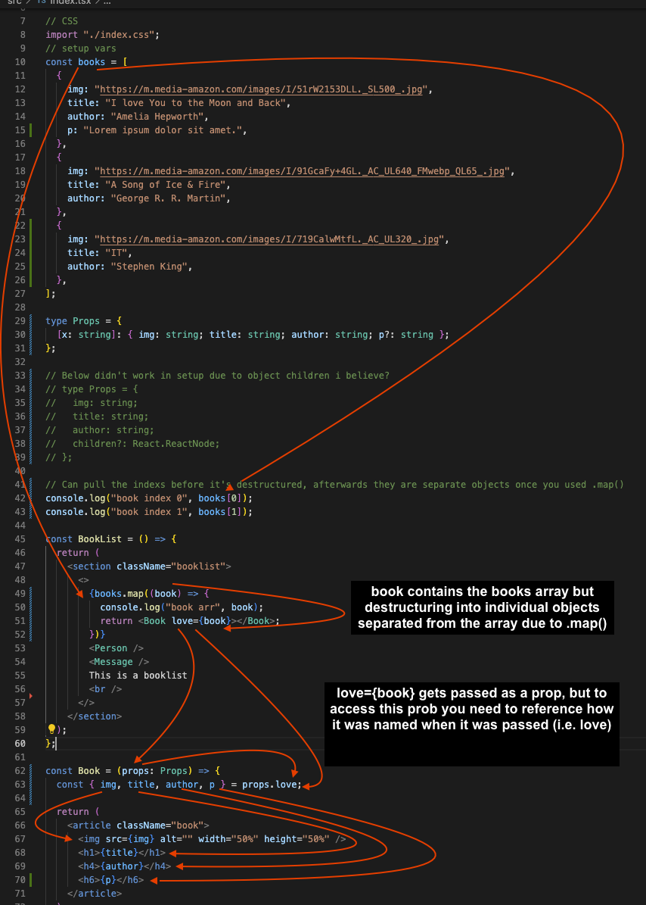
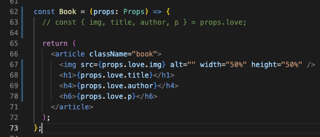
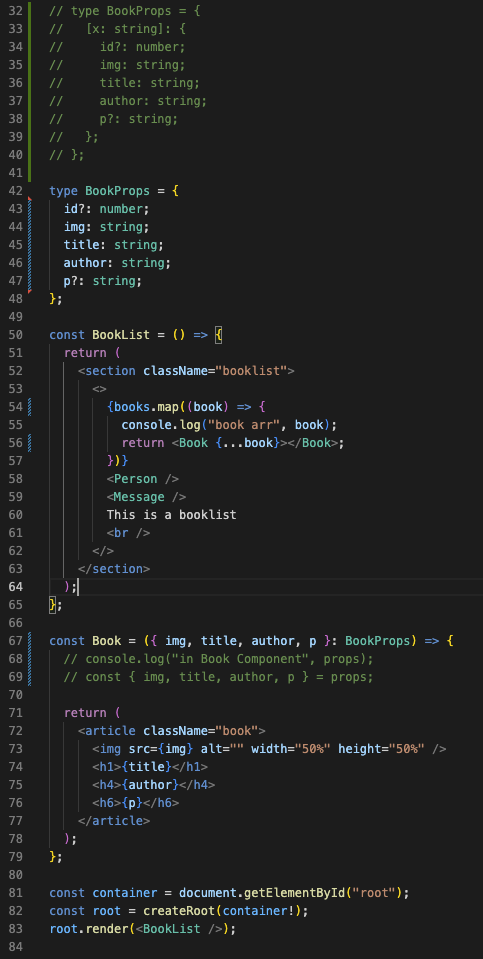
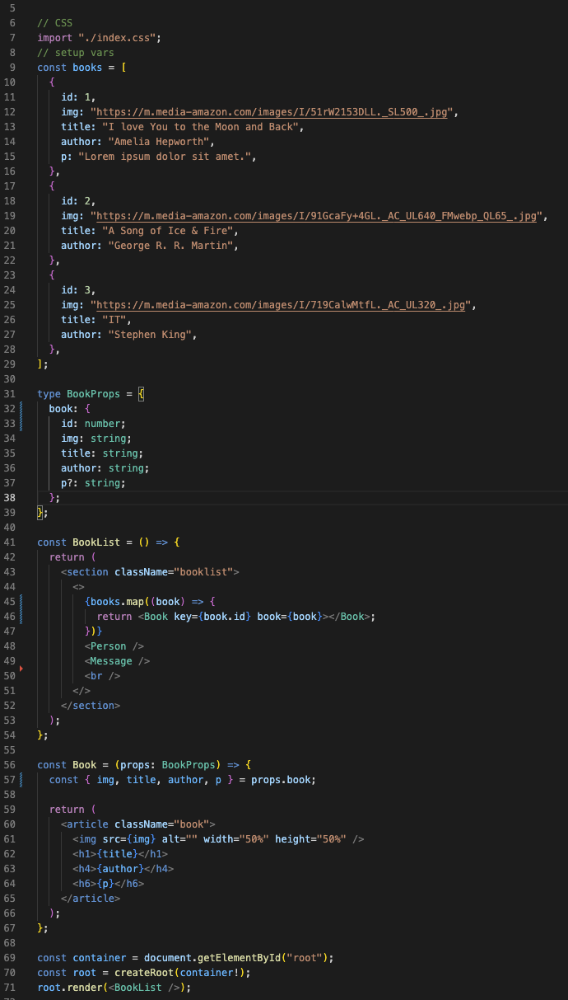

# EXAMPLES of Object DESTRUCTURING, also in personal OneNote Programming Notebook -> React -> Object destructuring I break down how it's all passed

## Add future examples of child destructuring

```
const Book = ({ img, title, author }: Props) => {
return (

<article className="book">

<h1>{title}</h1>
<h4>{author}</h4>
</article>
);
};
```

(about example as well)
One method that reduces adding props. extension into return

```
const Book = (props: any) => {
const { img, title, author } = props;
return (

<article className="book">

<h1>{title}</h1>
<h4>{author}</h4>
</article>
);
};
```

One method w\ props passed with props reference

```

const Book = (props: any) => {
return (

<article className="book">

<h1>{props.title}</h1>
<h4>{props.author}</h4>
</article>
);
};

```

## CHILD Destructuring

### Note the children type, in addition i made children option so not required by all props

```
type Props = {
img: string;
title: string;
author: string;
children?: JSX.Element;
};

const BookList = () => {
return (

<section className="booklist">
<Person />
<Message />
This is a booklist
<br />

```

## To add children elements you need to have open/close tags for your props object and contain the child right after the initial component open tag part as seen with p below

```

<Book
        img={firstBook.img}
        title={firstBook.title}
        author={firstBook.author}
      >

<p>
Lorem ipsum dolor sit amet consectetur adipisicing elit. Nam iusto
sapiente laboriosam beatae, fugiat quod est illo dolore asperiores
odio?
</p>
</Book>
<Book
        img={secondBook.img}
        title={secondBook.title}
        author={secondBook.author}
      />
</section>
);
};
```

## One way to destructure

```
const Book = ({ img, title, author, children }: Props) => {
return (

<article className="book">

<h1>{title}</h1>
<h4>{author}</h4>
{children}
</article>
);
};
```

## ALTERNATE way

```
const Book = (props): Props => {
const { img, title, author, children } = props;
return (

<article className="book">

<h1>{title}</h1>
<h4>{author}</h4>
{children}
</article>
);
};
```

## Additional object destructuring passingthrough into components

```
const BookList = () => {
return (

<section className="booklist">
<>
{books.map((book, index) => {
console.log("book arr", book);

          return <Book bookitem={book}></Book>;
        })}
        <Person />
        <Message />
        This is a booklist
        <br />
      </>
    </section>

);
};
```

### VERSION 1 of how you might like to do it

```
const Book = (props: BookProps) => {

console.log("in Book Component", props);

const { img, title, author, p } = props.bookitem;

return (

<article className="book">

<h1>{title}</h1>
<h4>{author}</h4>
<h6>{p}</h6>
</article>
);
};

### Version 2:

const Book = (props: BookProps) => {

console.log("in Book Component", props);

return (

<article className="book">

<h1>{props.bookitem.title}</h1>
<h4>{props.bookitem.author}</h4>
<h6>{props.bookitem.p}</h6>
</article>
);
};
```

### This shows examples on how destructuring will work as variables/arrays/objects are passed from Array [] -> destructuring -> Objects {}



### Replacement of the bottom of previous long code with just a longer form destructuring directly in return statement:



### Using spread operator, this included re-writing the Props Type as it no longer was a child object (terminology might be off)



### Without using a spread operator, example is you need to match the data elements with how the object is shaped before destructuring


